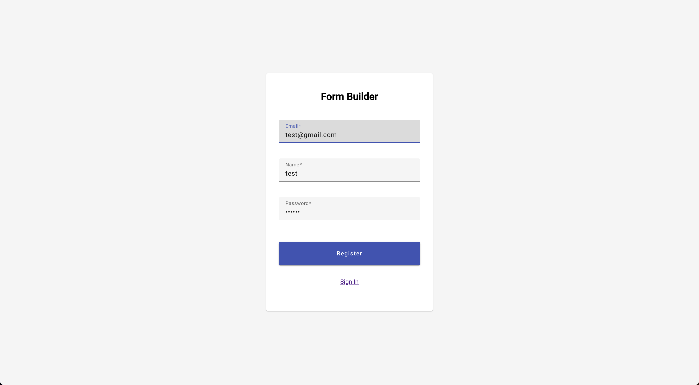
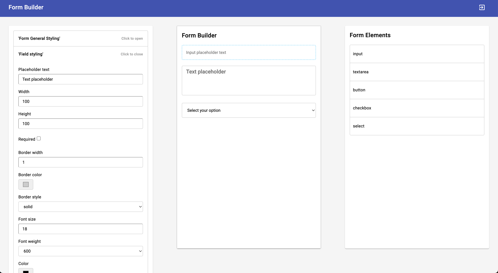
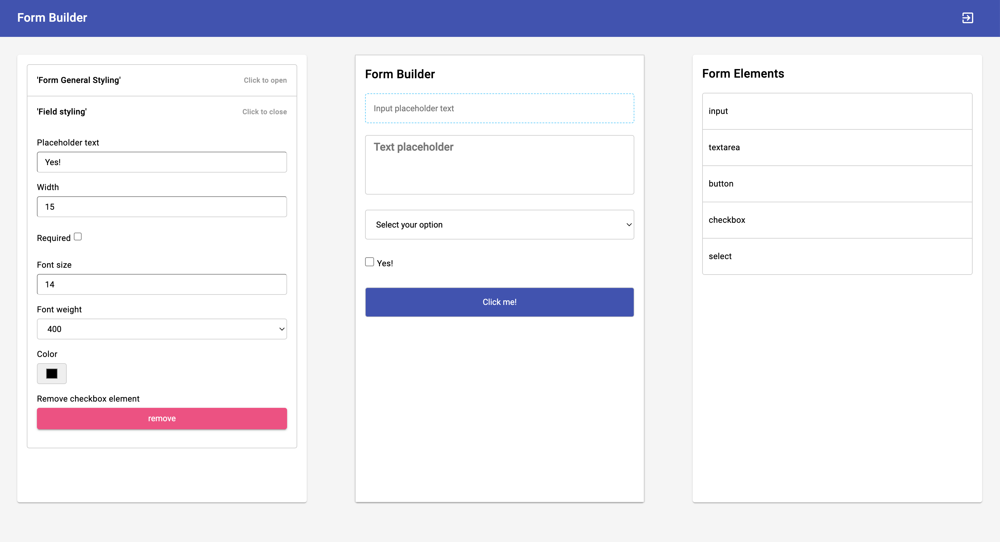

# Project FormBuilder

> This is a project I made for fun and learning reasons.

## Stack

- Angular
- Angular Material
- Angular Material CDK
- CDK Drag and Drop
- NgRx Store
- JSON Server
- RxJS
- SCSS

## About

I built this FormBuilder project to enhance my skills and explore new technologies. The project includes a simple authorization system based on JSON Server and JWT tokens.

The FormBuilder has a left column for styling options and a right column with form elements such as inputs, buttons, and headings. Users can drag elements to the middle column to build custom forms and adjust the styling of all elements using the options in the left column—setting colors, sizes, and more.

I implemented extensive unit tests, covering around 80% of the project, and added end-to-end tests with Cypress. This project taught me how to use the Drag and Drop CDK and reinforced the importance of testing.

## Screenshots

*Auth*

**Drag and drop form elements*. Customize element styles*

*Build and preview forms*
